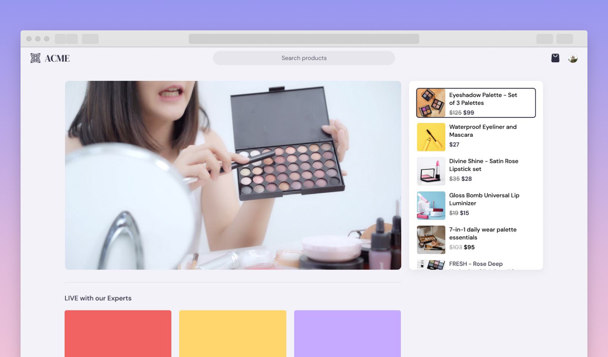

# Amazon IVS eCommerce demo

A demo web application intended as an educational tool for demonstrating how Amazon IVS, in conjunction with other AWS services, can be used to build a compelling customer experience for eCommerce use-cases.

**This project is intended for education purposes only and not for production usage.**

This is a serverless web application, leveraging [Amazon IVS](https://aws.amazon.com/ivs/), [AWS Lambda](https://aws.amazon.com/lambda/), [Amazon API Gateway](https://aws.amazon.com/api-gateway/), and [Amazon DynamoDB](https://aws.amazon.com/dynamodb/). The web user interface is a [single page application](https://en.wikipedia.org/wiki/Single-page_application) built using [responsive web design](https://en.wikipedia.org/wiki/Responsive_web_design) frameworks and techniques, producing a native app-like experience tailored to the user's device.
The demo showcases how customers can load and play an Amazon IVS stream and display browsable product information using TimedMetadata.
This demo uses a test stream which emits a TimedMetadata event every second with a productId. The productId is then used by the client to highlight the product being shown on stream.
Product details are stored and retrieved from DynamoDB.

## Getting Started

***IMPORTANT NOTE:** Deploying this demo application in your AWS account will create and consume AWS resources, which will cost money.*

To get the demo running in your own AWS account, follow these instructions.

1. If you do not have an AWS account, please see [How do I create and activate a new Amazon Web Services account?](https://aws.amazon.com/premiumsupport/knowledge-center/create-and-activate-aws-account/)
2. Log into the [AWS console](https://console.aws.amazon.com/) if you are not already. Note: If you are logged in as an IAM user, ensure your account has permissions to create and manage the necessary resources and components for this application.
3. Follow the instructions for deploying to AWS or running locally.

### Deploying to AWS or running locally
* This demo is comprised of two parts: `serverless` (the demo backend) and `web-ui` (the demo frontend)
* To run the demo's backend services locally or on your AWS account, follow the [detailed instructions](./serverless/README.md) to get started.

## Known issues and limitations
* The application was written for demonstration purposes and not for production use.
* Currently only tested in the us-west-2 (Oregon) region. Additional regions may be supported depending on service availability.

## About Amazon IVS
* Amazon Interactive Video Service (Amazon IVS) is a managed live streaming solution that is quick and easy to set up, and ideal for creating interactive video experiences. [Learn more](https://aws.amazon.com/ivs/).
* [Amazon IVS docs](https://docs.aws.amazon.com/ivs/)
* [User Guide](https://docs.aws.amazon.com/ivs/latest/userguide/)
* [API Reference](https://docs.aws.amazon.com/ivs/latest/APIReference/)

## License
This project is licensed under the MIT-0 License. See the LICENSE file.